# JXC TP2 Angular

Ce TP va vous permettre de prendre en main le framework d'Angular et d'appliquer les différentes notions vues en cours. Vous allez créer une application Angular pour afficher différentes informations récupérées d'une API, gérer les échanges entres différents composants et réaliser un formulaire. 

Ce TP, basé sur l'univers de Zelda, va vous permettre d'afficher une liste de monstres ou des créatures, de regarder leurs caractéristiques et d'effectuer une recherche. 

Voici un exemple de rendu possible : 

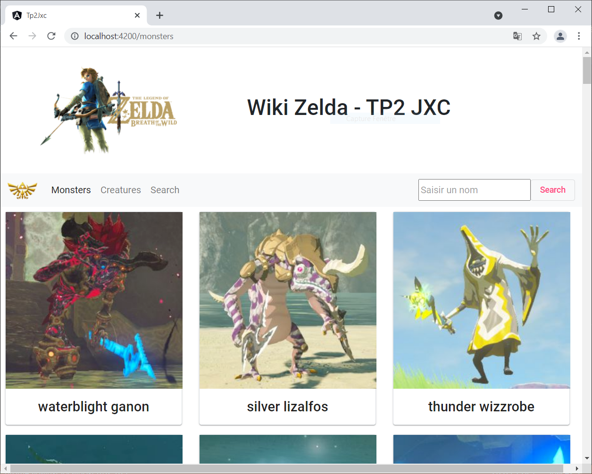


## Pré-requis 

Vérifiez que vous avez bien une installation de node.js et NPM sur votre ordinateur. 
Vous allez utiliser CLI (Command Line Interface) pour mettre en place notre application web :

```sh
npm install -g @angular/cli
```

L'IDE à utiliser est VisualCode Studio. Une fois installé, vous pouvez le lancer depuis un terminal en vous plaçant dans le répertoire de votre projet et en tapant la commande :

```sh
code .
```

Afin de tester le frontend, il faudra ouvrir un navigateur web. Vous pouvez utiliser la fonction `console.log(message);` pour afficher des messages, qui seront visibles dans la console de votre navigateur. 

## Création du nouveau projet 

```sh
$ ng new TP_Angular
? Would you like to add Angular routing? Yes
? Which stylesheet format would you like to use? (Use arrow keys)
> CSS
  SCSS   [ https://sass-lang.com/documentation/syntax#scss                ]
  Sass   [ https://sass-lang.com/documentation/syntax#the-indented-syntax ]
  Less   [ http://lesscss.org                                             ]

```

Vous pouvez choisir la manière dont vous allez écrire le style de vos pages web (CSS, SCSS, etc.).

Pour lancer le serveur : 

```sh
$ ng serve --open
```

avec l'option `--open`, un browser se lancera et se connectera au front. L'URL par défaut est : `http://localhost:4200`. L'application va se recharger automatiquement dès qu'un fichier source est enregistré. 


## Exercice 1 : Composant de base du TP

Dans ce premier exercice, vous allez prendre en main l'arborescence du projet Angular et commencer une application basique. Elle sera complétée au fur et à mesure du TP. 

### Fichier index.html

Le fichier index.html est le premier fichier html a être affiché côté front. Créer une entête à votre application web. Cette entête sera toujours afffichée quelque soit la navigation de l'utilisateur. Vous pouvez vous aider de Bootstrap pour le design. 

Veuillez intégrer l'image `zelda.png` dans votre entête. 

Attention à l'endroit où vous allez insérer vos images dans votre projet Angular. Vous pouvez les intégrer dans le dossier `assets` situé dans `src`.

### Création de la barre de navigation

Vous allez maintenant devoir créer un nouveau composant Angular pour représenter une barre de navigation. 

```sh
$ ng generate component nav
```

Angular a généré plusieurs fichiers dans le répertoire `src/app/nav` :
- `nav.component.html` contient la structure du composant,
- `nav.component.ts` contient le comportement du composant, 
- `nav.component.css` contient le style du comportement. 

En même temps, Angular met à jour automatiquement le fichier `app.module.ts` : 

```diff
+ import { NavComponent } from './nav/nav.component';
...
@NgModule({
  declarations: [
    AppComponent,
    ...
+   NavComponent
  ]
  ...
```

Cette barre de navigation possèdera un logo et les trois items suivants : *Monsters, Creatures et Search*. 


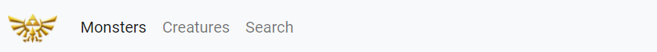


A cette étape, les différents items ne proposent pas de redirection vers un quelconque composant. Cela sera réalisé plus tard dans le TP. 

Une fois le code html de la barre de navigation créé, afficher ce composant dans le composant principal. 
Si vous n'avez pas modifié le nom du composant `nav`, son selecteur est `app-nav`. Dans le fichier html de `app-component.html` ajouter :

```html
<app-nav></app-nav>
```

N'oubliez pas de tester régulirement votre front. 


### Première route

Créer un composant `home` représentant la page principale du site. Vous y mettrez le détail de l'avancé du TP. 

Ce composant sera affiché par défaut en dessous de la barre de navigation lors de l'accès au front. Il pourra également accéder à ce composant s'il saisi l'URL : `http://localhost:4200/home`. Lorsqu'un utilisateur saisi une URL qui n'existe pas, celui-ci sera aussi redirigé vers le composant `home`. 

Nous allons donc ajouter des routes à notre application. 
Lors de la génération de l'application, des fichiers liés aux routes ont été générés. 

Modifier le fichier `app-routing.module.ts` :

```diff
const routes: Routes = [
+  {path: 'home', component: HomeComponent},
+  {path: '', redirectTo:'home', pathMatch:"full"},
+  {path: '**', component: HomeComponent}
];
```

Afin d'indiquer à quel endroit le composant doit être affiché, ajouter au template du composant principal : 

```diff
  <app-nav></app-nav>
+ <router-outlet></router-outlet>

```

Tester différentes URL sur votre navigateur pour voir l'influence des trois routes écrites dans le fichier `app-routing.module.ts`. 


### Première intéraction avec la barre de menu

Nous allons mettre en place une autre simulation de navigation : lorsque l'utilisateur clique sur l'image de la barre de menu, celui-ci est automatiquement dirigé vers l'URL : `http://localhost:4200/home`.

Modifier le fichier `nav-component.html` en ajoutant les deux attributs suivants à la balise `img` : 

```ts
[routerLink]="['/home']"
routerLinkActive="active"
```

Tester votre application en cliquant sur le logo. 


## Exercice 2 : Liste de monstres et de créatures

Nous allons créer une page dédiée à l'affichage d'une liste de monstres ou de créatures. 

### Simulation des données

Dans un premier temps, nous allons simuler les données à afficher sur l'application web. 

Récupérer le fichier `mock-data.ts`. 

Ce fichier, déjà rempli, contient les données de :
- 3 monsters,
- 3 creatures food,
- 3 creatures non food.

Observer le contenu de `DATA`. Quel est son type ?

Créer le fichier `IData.ts` au bon endroit et insérer l'interface suivante : 

```ts
export interface IData{
    id: number;
    category: string;
    name: string;
    description: string
    common_locations: string[]
    image: string
    drops?: string[]
    hearts_recovered?: number
    cooking_effect?: string
}
```

### Affichage de la liste

Vous allez créer deux composants permettant de gérer l'affichage de la liste des monstres et créatures :
- le composant `list` qui contiendra une liste de IData, c'est-à-dire tous les monstres/créatures de la liste à afficher.
- le composant `item` qui permet d'afficher une card pour un monstre ou une créature. 


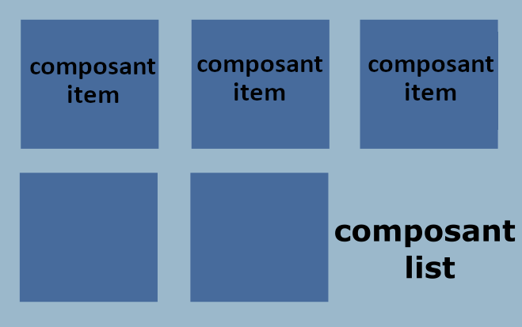


**Composant list**

Le composant `list` possède une donnée `dataList` de type `IData[]` qui contiendra tous les monstres/créatures à afficher (fichier *list.component.ts*). 

Son template permettra de parcourir tous les éléments de la liste `dataList` et d'afficher pour chacun le composant `item` (fichier *list.component.html*). 

Le composant `list` envoi donc une donnée au composant `item`. 

**Composant item**

Ce composant va permettre d'afficher une card de material contenant pour un monstre ou une créature donné son image et son nom. 

La classe typescript associée à ce composant va contenir une donnée `myData` de type `IData`. Cette donnée sera initialisée par le composant `list`. Vous devez donc utiliser le décorateur `@Input`. 

Pour l'affichage de la card, vous allez utiliser Materials, une bibliothèque fournissant un ensemble de composants Angular <a href="https://material.angular.io/components/card/overview">(voir la doc Materials de card)</a>. La partie suivante du TP vous montre comment ajouter Angular Materials à votre projet et comment utiliser un module.

Une fois Materials et le module `MatCardModule` installés, vous utiliserez la balise `mat-card`, `img` et `mat-card-content` dans le template du composant `item`. Afficher les valeurs du nom et l'image stocké dans la donnée `myData`. Vous pouvez utiliser la directive `*ngIf="myData"` pour l'affichage de l'image. 

Voici un exemple de rendu :


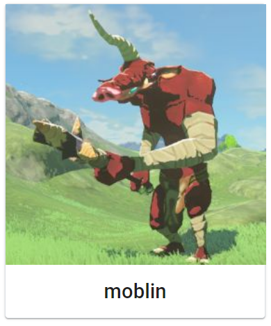


**Ajout de Angular Materials**

Vous devez avant tout <a href="https://material.angular.io/">installer `Materials`</a> :

```sh
$ ng add @angular/material
ℹ Using package manager: npm
✔ Found compatible package version: @angular/material@14.2.6.
✔ Package information loaded.

The package @angular/material@14.2.6 will be installed and executed.
Would you like to proceed? Yes
✔ Package successfully installed.
? Choose a prebuilt theme name, or "custom" for a custom theme: (Use arrow keys)     
> Indigo/Pink        [ Preview: https://material.angular.io?theme=indigo-pink ]      
  Deep Purple/Amber  [ Preview: https://material.angular.io?theme=deeppurple-amber ] 
  Pink/Blue Grey     [ Preview: https://material.angular.io?theme=pink-bluegrey ]    
  Purple/Green       [ Preview: https://material.angular.io?theme=purple-green ]     
  Custom
? Set up global Angular Material typography styles? No ? Set up global Angular Material typography styles? No  
? Include the Angular animations module? Include and enable animations
UPDATE package.json (1107 bytes)
✔ Packages installed successfully.
UPDATE src/app/app.module.ts (820 bytes)
UPDATE angular.json (3106 bytes)
UPDATE src/index.html (1319 bytes)
```

**Ajout d'un module Materials**

Une fois Material installé, nous devons importer le module voulu dans l'application. 
Dans le module principal, importer `MatCardModule` : 

```diff
+import { MatCardModule } from '@angular/material/card'
 ...
 imports: [
    BrowserModule,
    ....
+    MatCardModule,
  ],
  ...
  ```

A partir de cet endroit vous pourrez utiliser les cards de Materials dans l'application. 

### Récupération des données

Pour pourvoir tester l'affichage de vos deux composants `list` et `item`, vous devez récupérer des monstres et des créatures du fichier `mock-data.ts`.

Le service `dataMock` va gérer la récupération des données du mock (simulation de récupération des données d'un back). Ce service va être par la suite injecté dans le composant `list`. Ce composant va s'abonner au service pour récupérer et utiliser les données. 

Pour créer le service : 

```sh
$ ng generate service dataMock
```

Observer le fichier `data-mock.service.ts`. La classe `DataMockService` associée au service possède bien le décorateur `@Injectable`. 

Dans le service écrire une fonction `getAll()` retournant un `Observable<IData[]>` pour récupérer toutes les données de la liste `DATA` stockée dans le fichier `mock-data.ts`. 

Pour cela, vous devez tout d'abord importer : 

```ts
import { Observable, of } from 'rxjs';
import { IData } from './IData';
import { DATA } from './mock-data';
```

Dans la fonction `getAll()`, utiliser la fonction `of()` pour créer et retourner un simple Observable émettant la liste `DATA` :

```ts
getAll(): Observable<IData[]>{
    return of(DATA);
}
```

Maintenant, dans le fichier `list.component.ts`, ajouter en tant que paramètre d'entrée du constructeur un objet de type `MockDataService`. Ce service sera ainsi utilisable dans le composant. 

```ts
constructor(private dataMockService:DataMockService) {}
```

Créer également une méthode `getAll()` qui va réaliser une souscription à l'observable émit par la fonction `getAll()` du service. La valeur émise sera ainsi récupérée et stockée dans la donnée `dataList`.

```ts
getAll(): void{
  this.dataMockService.getAll()
    .subscribe({
      next: (data) => this.dataList = data,
      error: (e) => console.error(e),
      complete: () => console.info('end load all data')
    });
}
```

A quel endroit devez-vous appeler cette méthode dans le composant `list` ?

Tester votre front. N'oubliez pas d'insérer la balise correspondant au composant `list` dans le fichier html du composant principal. 
Cette ligne là sera supprimée par la suite :

```diff
   <app-nav></app-nav>
+  <app-list></app-list>
   <router-outlet></router-outlet>
```

## Exercice 3 : Séparation des monstres et créatures

Dans l'exercice précédent, vous avez affiché la liste de tous les monstres et créatures dans le composant principal. Vos deux composants `list` et `item` fonctionnent. 

Mettre en commentaire l'appel de la fonction `getAll()` dans le composant `list`. 

Mettre également en commantaire l'appel au composant `list` dans le fichier `app.component.html`.

Dans cet exercice vous allez utiliser le composant `list` pour afficher une liste contenant que des  monstres ou que des créatures en fonction de l'item sélectionné sur la barre de navigation. 
Lorsque l'utilisateur clique sur l'item `Monsters` du menu, la liste des monstres s'affiche à la place du composant `home` ou alors la liste des créatures s'affiche si l'item `Creatures` a été choisi.


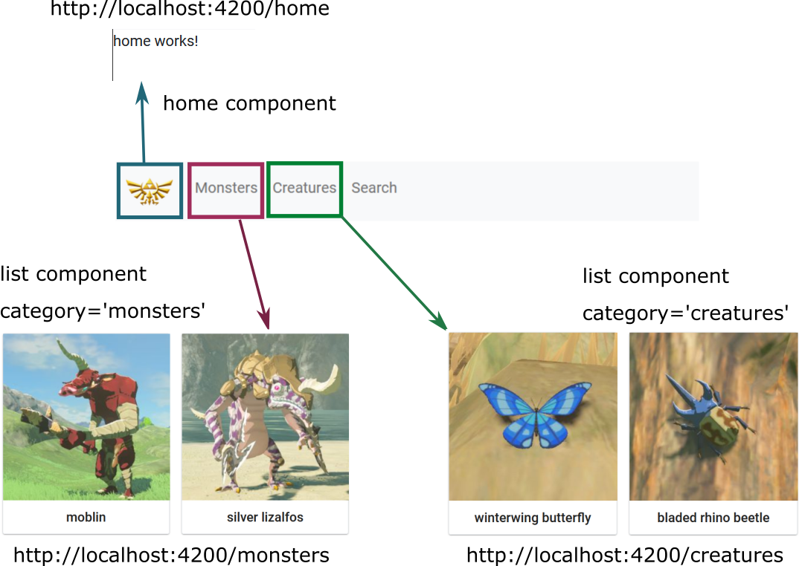


### Modification du service

Dans le fichier `data-mock.service.ts`, ajouter les fonctions suivantes : 
- `getMonsters()` pour emettre un observable de `IData[]` contenant que les monstres (`category="monsters"`),
- `getCreatures()` pour emettre un obervable de `IData[]` contenant que les créatures (`category="creaturesFood"` et `category="creaturesNoFood"`).
Comme pour la méthode précédente `getAll()`, l'observable sera créé via la méthode `of()` de `rxjs`.

Ajouter dans le fichier `list.component.ts` les fonctions correspondantes pour récupérer et mettre à jour la liste `listData`. 

Tester les deux méthodes. 

### Mise à jour des routes

Nous allons maintenant modifier les routes de notre frontend. 
Comme indiqué sur l'image précédente, nous voulons que l'URL `/monsters` nous affiche le composant `list` avec uniquement les monstres en données, et uniquement les créatures pour l'URL `/creatures`. 

Ajouter ces deux nouvelles routes dans le fichier `app-routing.module.ts`.

Modifier le fichier `nav.component.html` pour ajouter l'action derrière le clic sur les items `Monsters` et `Creatures` grâce à l'insertion des attributs `[routerLink]` et `routerLinkActive`. 

Nous allons devoir maintenant dans le composant `list` récupérer les bonnes informations par rapport à la route active. Dans quel cas doit on appeler `getMonsters()` ou `getCreatures()` ?

Dans le fichier `list.component.ts` ajouter l'import suivant : 

```ts
import { ActivatedRoute } from '@angular/router';
```

puis dans le constructeur : 

```diff
  constructor(
    private dataMockService:DataMockService, 
+    private route: ActivatedRoute
  ) { }
```

Avec le service `ActivatedRoute`, nous pouvons déterminer quelle est l'URL utilisée pour accéder au composant. 

Ajouter dans la méthode `ngOnInit()` : 

```ts
this.route.url.subscribe(res => {
  console.log(res)
    //TODO
});
```

Résultat pour le `console.log(res)` précédent : 


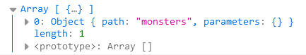


Compléter le code. 

Tester votre front en cliquant sur les items du menu et directement via l'URL.  


## Exercice 4 : Détail d'un monstre

Nous allons maintenant créer un autre composant pour pouvoir afficher le détail d'un monstre ou d'une créature. 


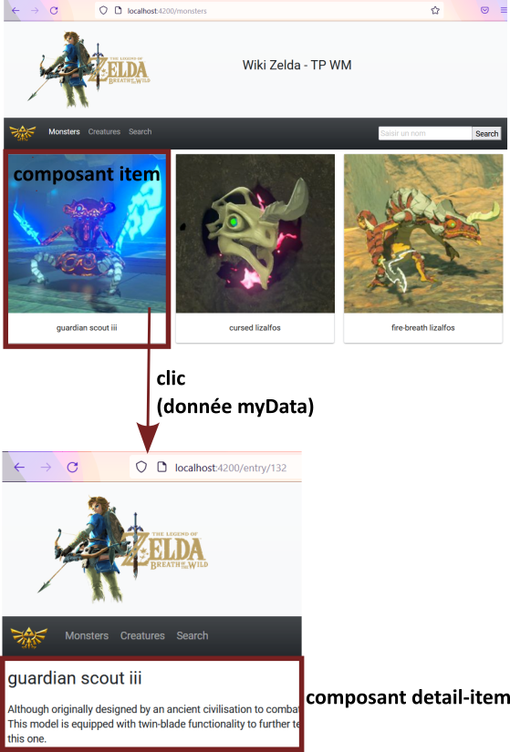


Comme le montre l'image ci-dessus, un clic sur l'image d'une *card* permet d'afficher le détail du monstre ou de la créature. 

### Composant detail-item

Créer un composant `detail-item`. Dans sa classe typescript, créer une donnée `entry` de type `IData` correspondant à la créature/monstre à afficher. 

Quelle est la particularité de cette donnée ? 

Afficher le détail de cette donnée dans le template HTML du composant `detail-item`.

### Mise à jour du composant item

Nous allons maintenant gérer le lien entre le composant `item` et le composant `detail-item`.

Dans  le fichier `app-routing.module.ts`, nous allons créer une nouvelle route dynamique en fonction de l'id de la créature : `/entry/:id`.

Dans le template associé au composant `item`, ajouter un lien vers cette route (attribut `routerLink` et `routerLinkActive`). Vous pouvez ajouter la balise `<a></a>` autour de l'image de la card par exemple. 

```ts
<a [routerLink]="['/entry', myData.id]" routerLinkActive="active">
```

Il faut maintenant faire le lien quand un utilisateur tape directement l'URL. Mettre à jour la fonction `ngOnInit()` du nouveau composant `detail-item`. Récupérer la route active et le paramètre associé à cette route pour mettre à jour la donnée `entry`.

Plusieurs possibilités sont possibles. Vous pouvez par exemple utiliser : 

```ts
 this.route.paramMap.subscribe( res => {
   //TODO
   //récupérer l'id passé dans l'URL
   //récupérer l'item correspondant à cet Id
 })
```

Attention, pour que votre front fonctionne correctement, vous devez penser à ajouter une méthode dans le service `data-mock.service.ts` afin de pouvoir récupérer les données de la créature/monstre du mock. 


## Exercice 5 : premier formulaire

Dans cet exercice vous allez créer un formulaire dans un nouveau composant. Ce formualaire utilisera le module <a href="https://material.angular.io/components/slide-toggle/overview">`MatSlideToggleModule` de Material</a>.

Nous allons créé un <a href="https://angular.io/guide/reactive-forms">formulaire réactif</a>, importer le module suivant dans 'app.module.ts' : 

```ts
import { ReactiveFormsModule } from '@angular/forms';
```

### Mise en place du composant 

Commencer par créer un composant `search`.

Ajouter une route `/search` à l'application et la lier à l'item `Search` de la barre de navigation. 

Tester votre front avec le template de base du composant `search`.

### Création du formulaire

Dans le fichier `search.composent.html` ajouter trois éléments `slide-toggle` du module `MatSlideToggleModule` de Material pour représenter les trois catégories : monsters, creatures food et creatures non food. 


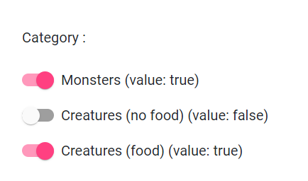


Inspirez-vous de la documentation et du code suivant : 

```html
<form>
  ...
  <mat-slide-toggle name="monstercheck"> 
  Monsters
  </mat-slide-toggle>
  ...
</form>
```

### Récupération des valeurs du formulaire

Dans le template du composant `search` nous allons récupérer les valeurs des éléments du formulaire et gérer les évènements liés. 

Créer trois booleans pour les trois slides toggle : 
- `checkedMonsters` qui sera initialisé à `true`,
- `checkedCreaturesFood` qui sera initialisé à `false`,
- `checkedCreaturesNoFood` qui sera initialisé à `true`.

Comme nous utilisons un formulaire réactif, créer un `FormGroup` contenant les différents `FormControl`. Chaque `FormControl` va nous permettre d'accéder à la valeur contenu dans le *'control'*, d'observer les changements de valeurs, ou encore de modifier l'état ou la valeur contenu dans le *'control'*. 

Vous pouvez utiliser un `FormBuilder` dans la méthode `ngOnInit()` pour créer votre `FormGroup` ou vous pouvez les créer directement. 

```ts
monstersGroup= new FormGroup({
  controlMonsters: new FormControl(....),
  ...
})
```

Choisissez correctement les valeurs par défaut de vos trois `FormControl`. 

Des modifications doivent être faite dans le template du composant. Nous devons liés les éléments HTML aux différents *'control'*. Ajouter les attributs `formGroup` et `formControlName` aux éléments HTML concernés. 

```diff
-<form>
+<form [formGroup]="monstersGroup">
  ...
-  <mat-slide-toggle name="monstercheck"> 
+  <mat-slide-toggle formControlName="controlMonsters"  name="monstercheck"> 
    Monsters
   </mat-slide-toggle>
  ...
</form>
```

Nous devons maintenant mettre automatiquement à jour nos trois booleans (`checkedMonsters`, `checkedCreaturesFood` et `checkedCreaturesNoFood`) lorsque la valeur d'un slide toggle est modifiée. Nous allons nous abonner à l'Observable `valueChanges` qui observe les changement de valeur du 'control' (`FormControl`).

Modifier la méthode `ngOnInit()` :

```ts
  ...
  this.monstersGroup.get('controlMonsters')
   .valueChanges.subscribe(res => { 
      ....
   })
  ...
```

Vous allez maintenant tester votre formulaire. 
Ajouter dans le template la valeur de vos trois booléens comme affiché dans la figure sitée au début de l'exercice. 

Faites varier les trois slide toggle du formulaire et observer les changements de valeur de vos trois booléens. 


## Exercice 6 : Modification du formulaire

Nous allons maintenant modifier notre formulaire en lui ajoutant une fonctionnalité. 

Ajouter à l'application le module Material `MatSelectModule`.

Nous allons ajouter un filtre à notre formulaire : si l'utilisateur à choisi d'afficher les créatures food (booléen à *true*), il peut les filtrer en fonction de leur donnée `cooking_effect`.


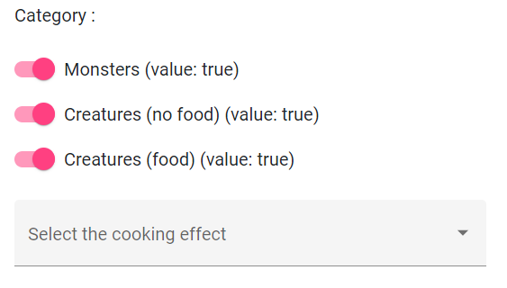


### Liste de cooking effect

Dans la classe Typescript associée au composant `search`, ajouter une liste contenant les différentes valeurs possible de la donnée `cooking_effect`. 

```ts
listEffects: string[] = ["defense up", "speed up", 'attack up']
```

### Selection du cooking effect

Dans le template de notre formulaire, ajouter <a href="https://material.angular.io/components/select/overview"> l'élément HTML select (`mat-select`)</a> afin de sélectionner le type de *'cooking effect'*. L'utilisateur peut sélectionner plusieurs valeurs (multiple).

Attention, cet élément ne doit s'afficher que si le booléen correspondant aux creatures food vaut true.

A compléter au fur et à mesure : 

```html
...
<mat-select multiple>
  <mat-option .......>....</mat-option>
</mat-select>
...
```

Dans la balise `mat-option`, penser à utiliser la directive `*ngFor` sur la liste d'effet :
```
*ngFor="let effect of listEffects" 
```

Tester votre `select` en affichant le front. 

### Ajout des interactions

Nous utilisons toujours le même formulaire réactif. 
Nous allons donc modifier notre structure de `FormGroup` pour integrer l'élément `select`.

Nous allons ajouter un niveau supérieur : 

```diff
+ searchGroup = new FormGroup({
+   controlEffect: new FormControl(),
    monstersGroup: new FormGroup({
          controlMonsters: new FormControl(....),
          ...
    })
+})
```

Modifier le template du composant `search` pour prendre en compte ces modifications. 

```diff
-<form [formGroup]="monstersGroup">
+<form [formGroup]="searchGroup">
  ...
+ <!-- un élément HTML avec l'attribut formGroupName="monstersGroup" -->
  ...
  <mat-slide-toggle formControlName="controlMonsters" name="monstercheck"> 
    Monsters
   </mat-slide-toggle>
  ...
  ...
- <mat-select multiple>
+ <mat-select formControlName="controlEffect" multiple>
    <mat-option .......>....</mat-option>
  </mat-select>
  ...
</form>
```

Attention les abonnements des trois `slide-toggle` doivent également être modifiés à cause du changement du `FormGroup` : 

```diff
  ...
- this.monstersGroup.get('controlMonsters')
+ this.searchGroup.get('monstersGroup.controlMonsters') 
   .valueChanges.subscribe(res => { 
      ....
   })
  ...
```

### Récupération des valeurs du select

Nous allons maintenant chercher à récupérer les valeurs du select que l'utilisateur à choisi.

Ajouter une liste de string `filteredEffects` dans la classe afin de récupérer les valeurs sélectionnées du select. 

Réaliser une souscription à l'Observable du `valueChanges` du bon `FormControl` pour mettre à jour `filteredEffects`. 

Tester votre front. 

## Exercice 7 : Affichage du select

Nous allons modifier l'affichage du select : 


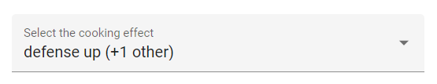


### Ajout d'une fonction displayEffect()

Dans le fichier `search.component.ts` créer une méthode `displayEffect()` permettant d'afficher le format particulier au select (voir l'image).

Réaliser les étapes suivantes : 
- Récupérer la première valeur du tableau `filteredEffects` si elle existe.
- Récupérer le nombre d'éléments présent dans cette liste pour l'afficher entre parenthèse.
  
La fonction retourne directement la chaîne de caractère créée (e.g. "", "speed up" ou encore "speed up (+2 others")).


### Modification du template

Vous afficherez dans le fichier `search.component.html` le résultat de cette fonction dans une balise `mat-select-trigger` de votre `mat-select`. 

```diff
...
<mat-select formControlName="controlEffect" multiple>
+    <mat-select-trigger>......</mat-select-trigger>
    <mat-option .......>....</mat-option>
</mat-select>
...
```

Tester de nouveau votre front. Si vous avez le temps, vous pouvez ajouter d'autres filtres. 

## Exercice 8 : Liste et formulaire

Vous allez maintenant filtrer votre liste de monstres et créatures en fonction des résultats du formulaire (composant `search`).

Récupérer tous les monstres et créatures dans une données `listData` de la classe `SearchComponent`. La fonction créée doit être `private`.

Créer une autre donnée `filteredData` permettant de récupérer que les monstres et créatures filtrés. Elle sera initialisée grâce à l'appel de la fonction `_updateListSlide()` (décrite dans la partie suivante) dans la méthode `ngOnInit()`, lorsque le composant est chargé en fonction des valeurs par défaut de notre formulaire (trois booléens). 

### Filtrer selon les catégories

Créer la méthode `_updateListSlide()`. Elle permettra de mettre à jour la liste `filteredData` grâce à la valeur de retour de la fonction `_filterListSlide()`.

```ts
private _updateListSlide(): void{
    this.filteredData = .....
}
```

Créer la méthode `_filterListSlide()`. Elle permet de filtrer la liste principale `listData` en fonction des valeurs des trois booléens. Elle retourne la liste filtrée. Utiliser la méthode `filter` sur la liste `listData`. Vous pouvez également utiliser la méthode `include()` pour savoir par exemple si la catégorie du monstre à filtrer vaut bien "monstres". 

```ts
private _filterListSlide(): IData[]{
    return this.listData.filter(option => {
      //TODO
    })
  }
```

Afficher ensuite le résultat de la liste triée dans le template. En dessous du formulaire, ajouter la balise du composant `app-list` prenant en valeur d'entrée `filteredData`. N'oubliez pas le décorateur `@Input()` au niveau de la variable `dataList` du la classe `ListComponent`.

Attention, le composant ne s'affiche que si la liste filtrée contient au moins un élément. 

Tester votre application. 

### Ajout du filtre sur cooking effect

Terminer votre formulaire. Vous devez compléter le filtrage des données avec le select sur la donnée `cooking_effect`. 

Vous pouvez créer une méthode `_filterListEffect()` pour ajouter un autre filtre à la liste triée (même technique que pour la méthode `_filterListSlide()`.

La méthode `_udpateList()` peut etre créée pour prendre en compte tous les filtres de votre formulaire. 

A quel endroit devez vous appeler cette méthode pour afficher automatiquement la liste filtrée au moindre changement de l'utilisateur dans le formulaire ? 

Tester votre application. 

## Exercice 9 : Bonus - Recherche par le nom

Dans la barre de navigation de l'application, nous allons ajouter un champ de recherche. L'utilisateur pourra saisir le nom d'un monstre ou créature pour accéder directement à sa page (composant `creature`).

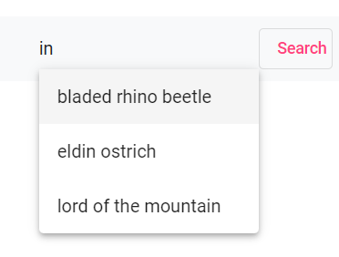

Vous allez devoir utiliser d'autres composants de Materials : <a href="https://material.angular.io/components/autocomplete/overview">`MatAutocompleteModule`</a> et <a href="https://material.angular.io/components/input/overview">`MatInputModule`</a>. Importez les dans le module principal. 

Créer un nouveau composant `searchName`. Intégrer le dans la barre de navigation. 

### Champ Input

Dans le template de ce nouveau composant, compléter le formulaire avec les instructions suivantes. 

Créer un champ input `matInput` qui sera lié à une balise `mat-autocomplete` afin d'indiquer les différentes possiblités à l'utilisateur lorsqu'il réalise une saisi sur ce champ (`[matAutocomplete]="auto"` côté input et `#auto="matAutocomplete"` côté `mat-autocomplete`). 

```html
...
<input matInput type="text"  
  placeholder="Saisir un nom"  
  [matAutocomplete]="auto"/>
<mat-autocomplete autoActiveFirstOption #auto="matAutocomplete"> 
  ...       
</mat-autocomplete>
...
```

Ajouter ensuite un `FormControl` dans la classe typescript pour le champ input. Effectuer le lien dans le template (`[formControl]="controlName"`). 

Dans la balise `mat-autocomplete`, ajouter une balise `mat-option` qui va nous permettre d'afficher tous les noms des éléments de la liste filtrée `filteredList`. 

```diff
  ...
  <input matInput type="text"  
    placeholder="Saisir un nom"
+   [formControl]="controlName"   
    [matAutocomplete]="auto"/>
  <mat-autocomplete autoActiveFirstOption #auto="matAutocomplete"> 
+   <mat-option *ngFor="let option of filteredList" [value]="option">
+     ... 
+   </mat-option>           
  </mat-autocomplete>
  ...
```

Dans la classe typescript du composant `search-name`, récupérer toutes les données du mock dans une donnée `listData`. Créer également une liste `filteredList` qui sera par la suite mise à jour lors de la saisie au clavier sur le champ input. Au début, la liste filtrée contient toutes les données. 

Créer une fonction `displayName(item: IData)` permettant d'afficher dans le template le nom de la créature/monstre lorsque l'utilisateur sélectionne un des noms de la liste (dans la balise `mat-autocomplete`, rajouter comme attribut : `[displayWith]="displayName"`).

```ts
displayName(item: IData): string {
    //TODO
}
```

S'abonner à l'Observable `changeValues` du `FormControl` de l'input. Vous allez devoir au préalable changer la forme des données de l'Observable via la méthode `pipe()` et `map()`. L'observable récupéré avec le `subscribe` correspondra à la liste filtrée en fonction de la valeur de l'input. 

Aidez-vous des codes suivants : 

```ts
private _filterName(value: string): IData[]{
    //TODO
    //filter la liste filteredList avec tous les noms possédant 'value'.
}
```

```ts
...
//Dans ngOnInit
this.controlName.valueChanges.pipe(
  map( value => {
    //Si value est un string (typeof(value) === 'string') :
    //Filtrer la liste filteredList en fonction de 'value'
    //Sinon, si value est un objet IData (typeof(value) === 'object')
    //retourner le résultat sous la forme d'un tableau d'objet
    //TODO
  })
).subscribe(
  //TODO
) 
...
```

### Validation du formulaire

Ajouter un bouton pour soumettre le formulaire du côté du template.

Rajouter une fonction `onFormSubmit()` dans la classe. Cette fonction va permettre de gérer la validation du formulaire. Lier cette fonction au template : `(ngSubmit)="onFormSubmit()"` et ajouter `console.log("submit form")` dans le corps de la fonction pour la tester.  Si ce n'est pas déjà fait, penser également à ajouter `FormsModule` au fichier `app.module.ts`. 

```ts
<form (ngSubmit)="onFormSubmit()">
```

Ajouter la donnée `selectedData` de type `IData` pour y stocker l'objet correspondant au nom saisi dans l'input.

A partir du `formControl` du champ input, récupérer l'objet correspondant pour le stocker dans `selectedData`. La valeur du `formControl` peut être soit directement l'objet de type IData, soit un string correspondant au nom de l'item (dans ce cas, la méthode `find` sur la liste de données peut être utilisée). 

```ts
onFormSubmit():void{
    //Peut etre soit un objet IData ou un string
    if(typeof(this.controlName.value) === "string"){
      //TODO
    }
    else //TODO
}
```

Si l'objet `selectedData` de type `IData` existe bien, forcer la navigation dans l'application à la route `/creature/:id`. 

```ts
private _goToCreature(){
    //TODO
    this.router.navigate(['/creature', idCreature]);
}
```

Tester toute votre application web. 

## Exercice 10 : Récupération d'un monstre à partir de l'API

Vous avez réalisé une application fonctionelle avec une simulation de données grâce au fichier `mock-data.ts`. 
Vous allez maintenant modifier l'application pour récupérer les données directement depuis l'API suivante : <a href="https://botw-compendium.herokuapp.com/api/v2">`https://botw-compendium.herokuapp.com/api/v2`</a>.
Par conséquent nous n'allons plus utiliser le service `data-mock.service.ts`. De plus, certaines fonction seront allégées. 

### Création d'un nouveau service

Créer un nouveau service `dataApiService` qui remplacera `dataMockService`. Nous allons comme précédement travailler avec les Observables (rxjs).

Ajouter dans le nouveau service une donnée pour stocker l'adresse de l'API.

Notre nouveau service va maintenant utiliser le service `HttpClient`. Ajouter le module `HttpClientModule` au module principal de l'application, puis injecter le dans le service `dataApiService`.

```diff
+import { HttpClientModule } from '@angular/common/http';
...
imports: [
    BrowserModule,
    ....
+   HttpClientModule
]
...
```

```ts
constructor(private http: HttpClient) {}
```


### Récupération des données de l'API

Regarder la <a href="https://gadhagod.github.io/Hyrule-Compendium-API/#/">documentation de l'API</a> afin de déterminer les différents endpoints utiles.
- https://botw-compendium.herokuapp.com/api/v2
- https://botw-compendium.herokuapp.com/api/v2/category/<category> (monsters ou creatures)
- https://botw-compendium.herokuapp.com/api/v2/entry/<entry> (avec id ou nom)

Tester quelques appels à l'API pour regarder de quelle manière est reconstituée la réponse.

Dans le fichier `IData.ts`, créer une ou des interface(s) afin de correspondre avec ces types de retour. Vous pouvez compléter ce fichier au fur et à mesure. 

Pour récupérer un monstre, vous pourrez par exemple utiliser : 

```ts
export interface IDataEntry{
    data: IMonster | ICreature
}
```

### Récupération d'un monstre/créature

Dans le service `dataApiService`, créer une fonction pour récupérer un monstre ou une créature par son id. Le paramètre d'entrée de la fonction doit être soit un id et elle doit retrouner un Observable de IMonster ou ICreature pour pouvoir l'utiliser sans problème dans le reste de l'application. 

Utiliser la méthode `get` du service `HttpClient`. Spécifier le type de réponse attendu par la méthode `get` (une des interfaces du fichier `IData.ts`, par exemple `IDataEntry`).  

Nous allons devoir transformer les données reçu par le `get`, en données utilisables dans l'application (`Observable<IMonster>` par exemple). Utiliser la fonction `map()` pour transformer les données puis les passer en paramètre de la méthode asynchrone `pipe()`. 

Vous pouvez vous inspirer de ce code : 

```ts
 getItem(nom:number|string): Observable<....>{ 
    return this.http.get<IDataEntry>(`..todo...`)
      .pipe(
        map(res => {
          //transformation des données 
        })
      )
  }
```

Dans le composant `DetailItem`, remplacer l'utilisation du service `dataMockService` par le nouveau service `dataApiService` (méthode `getItem()`). 

Penser à gérer les erreurs d'accès à l'API.

Tester les URL suivante : 
  - http://localhost:4200/entry/100 
  - http://localhost:4200/entry/108


## Exercice 11 : Récupération de toutes les données de l'API

Vous savez comment récupérer un monstre ou une créature de l'API. 
Modifier maintenant le service `dataApiService` pour que toute l'application utilise les données de l'API. 
Vous devez ajouter des méthodes pour récupérer toutes les données, que les monstres ou que les créatures. 

Modifier par conséquent les composants utilisant l'ancien service `dataMockService`.

Tester votre application. 
